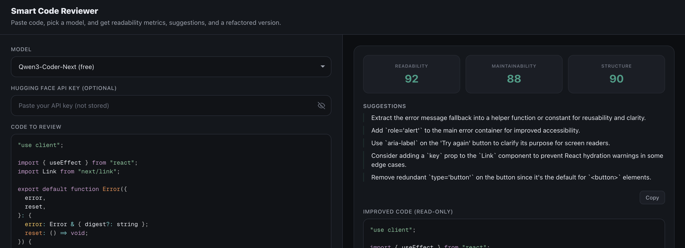

# Smart Code Reviewer

Paste code, pick a model, and get readability metrics, suggestions, and a refactored version.



## Features

- **Paste code** — Paste or type code; markdown code fences are stripped automatically.
- **Multiple models** — Free Hugging Face options (Qwen3-Coder-Next, SmolLM3 3B) and key-based options (OpenAI GPT-4o Mini / GPT-3.5 Turbo, Claude 3 Haiku / 3.7 Sonnet, Gemini 3 Flash / 2.5 Flash Lite).
- **Structured output** — Readability, maintainability, and structure scores; a list of feedback items; and an improved code snippet.
- **Per-model API keys** — Required for OpenAI, Claude, and Gemini; optional for Hugging Face (server can use `HF_TOKEN` or you can supply a key in the UI).

## Tech stack

- Next.js 16 (App Router)
- React 19
- TypeScript
- Tailwind CSS 4
- Prism.js (code highlighting)

## Prerequisites

- Node.js 18+
- npm (or yarn, pnpm, bun)

## Running locally

1. Clone the repo and go into the project directory:

   ```bash
   git clone <repo-url>
   cd code-reviewer
   ```

2. Copy the example env file and optionally add your Hugging Face token:

   ```bash
   cp env.example .env
   ```

   Edit `.env` and set `HF_TOKEN=your_token_here` if you want to use Hugging Face free-tier models without entering a key in the UI.

3. Install dependencies:

   ```bash
   npm install
   ```

4. Start the development server:

   ```bash
   npm run dev
   ```

5. Open [http://localhost:3000](http://localhost:3000) in your browser.

## Environment variables

See `env.example`. The only variable is **HF_TOKEN** (optional). It improves the free-tier experience for Hugging Face models when users don’t provide their own key.

## Scripts

| Command         | Description              |
| --------------- | ------------------------ |
| `npm run dev`   | Start dev server         |
| `npm run build` | Build for production     |
| `npm run start` | Start production server  |
| `npm run lint`  | Run ESLint               |

## Project structure

- `src/app` — App Router pages and `/api/review` API route
- `src/components/pages/home` — Home page (editor, model dropdown, API key input, results)
- `src/constants` — Model config, max code length, API path
- `src/types` — Shared TypeScript types
- `src/utils` — Validation and code stripping helpers
